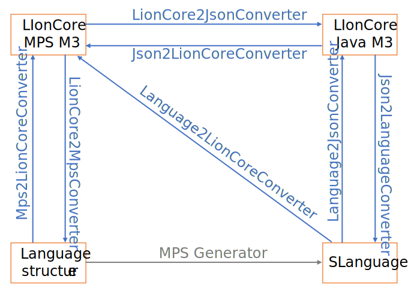

:link-FromLionCore: http://127.0.0.1:63320/node?ref=r%3A02305548-3e8d-4e78-b276-85a6e515bf18%28io.lionweb.mps.converter.lang.runtime%29%2F4358543712230771549 
:link-ToLionCore: http://127.0.0.1:63320/node?ref=r%3A02305548-3e8d-4e78-b276-85a6e515bf18%28io.lionweb.mps.converter.lang.runtime%29%2F4759305942576528868 
:link-M1ToJson: http://127.0.0.1:63320/node?ref=r%3A677983a1-6578-432d-8175-68c906e0375c%28io.lionweb.mps.json%29%2F7272917167317926507 
:link-M2ToJson: http://127.0.0.1:63320/node?ref=r%3A677983a1-6578-432d-8175-68c906e0375c%28io.lionweb.mps.json%29%2F2383283386661098924 
:link-JsonToM1: http://127.0.0.1:63320/node?ref=r%3A677983a1-6578-432d-8175-68c906e0375c%28io.lionweb.mps.json%29%2F5605122842155233745 
:link-JsonToM2: http://127.0.0.1:63320/node?ref=r%3A677983a1-6578-432d-8175-68c906e0375c%28io.lionweb.mps.json%29%2F1754772619073726812 

:link-LionCore2JsonConverter: http://127.0.0.1:63320/node?ref=r%3A08a4d3db-1d32-4a82-9df0-5b66cc2b1164%28io.lionweb.mps.json.lioncore%29%2F6279885863242958594
:link-Json2LionCoreConverter: http://127.0.0.1:63320/node?ref=r%3A08a4d3db-1d32-4a82-9df0-5b66cc2b1164%28io.lionweb.mps.json.lioncore%29%2F630989536490666349
:link-Mps2LionCoreConverter: http://127.0.0.1:63320/node?ref=r%3Aafdf88c6-003c-454f-85c3-e72d4fc9ce83%28io.lionweb.mps.converter.m2.mps2lioncore%29%2F2656571587266463715
:link-LionCore2MpsConverter: http://127.0.0.1:63320/node?ref=r%3A303e2235-6078-45d3-bca1-4bd6b06c2770%28io.lionweb.mps.converter.m2.lioncore2mps%29%2F755186209555144119
:link-Language2LionCoreConverter: http://127.0.0.1:63320/node?ref=r%3Ae45778bd-f0ea-44bf-9316-68791f46fac0%28io.lionweb.mps.converter.m2.language2lioncore%29%2F4759305942562826472
:link-IndirectLanguage2LionCoreConverter: http://127.0.0.1:63320/node?ref=r%3Ae45778bd-f0ea-44bf-9316-68791f46fac0%28io.lionweb.mps.converter.m2.language2lioncore%29%2F4759305942570562814
:link-Language2JsonConverter: http://127.0.0.1:63320/node?ref=r%3A6239253d-0ab2-49c2-bcf4-81f1b9a92f3e%28io.lionweb.mps.json.language%29%2F4759305942562826472
:link-IndirectLanguage2JsonConverter: http://127.0.0.1:63320/node?ref=r%3A6239253d-0ab2-49c2-bcf4-81f1b9a92f3e%28io.lionweb.mps.json.language%29%2F4759305942570562814
:link-FineGrainedClosureLanguage2JsonConverter: http://127.0.0.1:63320/node?ref=r%3A6239253d-0ab2-49c2-bcf4-81f1b9a92f3e%28io.lionweb.mps.json.language%29%2F548682208082610794
:link-Json2LanguageConverter: http://127.0.0.1:63320/node?ref=r%3A6239253d-0ab2-49c2-bcf4-81f1b9a92f3e%28io.lionweb.mps.json.language%29%2F2585378165952945300

:link-LionWeb2MpsConverter: http://127.0.0.1:63320/node?ref=r%3A00cfecac-5da5-48e5-8a70-507b9f69321c%28io.lionweb.mps.json.instance.lionweb2mps%29%2F2585378165952866695
:link-MergingLionWeb2MpsConverter: http://127.0.0.1:63320/node?ref=r%3A00cfecac-5da5-48e5-8a70-507b9f69321c%28io.lionweb.mps.json.instance.lionweb2mps%29%2F2784852159266446449
:link-AMps2LionWebConverter: http://127.0.0.1:63320/node?ref=r%3A42e59ade-052b-4e0d-b0f5-6d4ec03ed4f0%28io.lionweb.mps.json.instance.mps2lionweb%29%2F4759305942556731328
:link-ClosureMps2LionWebConverter: http://127.0.0.1:63320/node?ref=r%3A42e59ade-052b-4e0d-b0f5-6d4ec03ed4f0%28io.lionweb.mps.json.instance.mps2lionweb%29%2F7986257291398353286
:link-DescendantMps2LionWebConverter: http://127.0.0.1:63320/node?ref=r%3A42e59ade-052b-4e0d-b0f5-6d4ec03ed4f0%28io.lionweb.mps.json.instance.mps2lionweb%29%2F7986257291398064448
:link-ListedMps2LionWebConverter: http://127.0.0.1:63320/node?ref=r%3A42e59ade-052b-4e0d-b0f5-6d4ec03ed4f0%28io.lionweb.mps.json.instance.mps2lionweb%29%2F7986257291398061321

:link-SLanguage: http://127.0.0.1:63320/node?ref=8865b7a8-5271-43d3-884c-6fd1d9cfdd34%2Fjava%3Aorg.jetbrains.mps.openapi.language%28MPS.OpenAPI%2F%29%2F%7ESLanguage
:link-Language: http://127.0.0.1:63320/node?ref=6ed54515-acc8-4d1e-a16c-9fd6cfe951ea%2Fjava%3Ajetbrains.mps.smodel%28MPS.Core%2F%29%2F%7ELanguage
:link-SLanguageAdapter: http://127.0.0.1:63320/node?ref=6ed54515-acc8-4d1e-a16c-9fd6cfe951ea%2Fjava%3Ajetbrains.mps.smodel.adapter.structure.language%28MPS.Core%2F%29%2F%7ESLanguageAdapter
:link-LanguageRuntime: http://127.0.0.1:63320/node?ref=6ed54515-acc8-4d1e-a16c-9fd6cfe951ea%2Fjava%3Ajetbrains.mps.smodel.language%28MPS.Core%2F%29%2F%7ELanguageRuntime
:link-SLanguageId: http://127.0.0.1:63320/node?ref=6ed54515-acc8-4d1e-a16c-9fd6cfe951ea%2Fjava%3Ajetbrains.mps.smodel.adapter.ids%28MPS.Core%2F%29%2F%7ESLanguageId

:link-ILanguageLookup: http://127.0.0.1:63320/node?ref=r%3A303e2235-6078-45d3-bca1-4bd6b06c2770%28io.lionweb.mps.converter.m2.lioncore2mps%29%2F3726135215532697104

:link-IImportedLanguage: http://127.0.0.1:63320/node?ref=r%3A303e2235-6078-45d3-bca1-4bd6b06c2770%28io.lionweb.mps.converter.m2.lioncore2mps%29%2F36799617969071123
:link-ExistingImportedLanguage: http://127.0.0.1:63320/node?ref=r%3A303e2235-6078-45d3-bca1-4bd6b06c2770%28io.lionweb.mps.converter.m2.lioncore2mps%29%2F36799617970290621
:link-ReadonlyImportedLanguage: http://127.0.0.1:63320/node?ref=r%3A303e2235-6078-45d3-bca1-4bd6b06c2770%28io.lionweb.mps.converter.m2.lioncore2mps%29%2F755186209568755786
:link-NewImportedLanguage: http://127.0.0.1:63320/node?ref=r%3A303e2235-6078-45d3-bca1-4bd6b06c2770%28io.lionweb.mps.converter.m2.lioncore2mps%29%2F755186209568767555 

:link-ILanguageCreator: http://127.0.0.1:63320/node?ref=r%3A303e2235-6078-45d3-bca1-4bd6b06c2770%28io.lionweb.mps.converter.m2.lioncore2mps%29%2F36799617970567305
:link-ILionCoreConstants: http://127.0.0.1:63320/node?ref=r%3A3303ef0b-a58e-4f50-b3cb-bd3d7aaf3653%28io.lionweb.mps.m3.runtime%29%2F6625720587543565117

:link-IJsonConstants: http://127.0.0.1:63320/node?ref=r%3A677983a1-6578-432d-8175-68c906e0375c%28io.lionweb.mps.json%29%2F6625720587569559927
:link-IdEncoder: http://127.0.0.1:63320/node?ref=r%3Aea3bdd37-0680-4524-8252-d8093e3b6903%28io.lionweb.mps.converter.util%29%2F2585378165967625423
:link-ILanguageDependsOnFinder: http://127.0.0.1:63320/node?ref=r%3Aea3bdd37-0680-4524-8252-d8093e3b6903%28io.lionweb.mps.converter.util%29%2F4362011980479248043
:link-LionWebAttributeFinder: http://127.0.0.1:63320/node?ref=r%3A3303ef0b-a58e-4f50-b3cb-bd3d7aaf3653%28io.lionweb.mps.m3.runtime%29%2F465557625272401568
:link-MpsLanguageConverter: http://127.0.0.1:63320/node?ref=r%3A3303ef0b-a58e-4f50-b3cb-bd3d7aaf3653%28io.lionweb.mps.m3.runtime%29%2F3631234780376153588
:link-AnnotationFinder: http://127.0.0.1:63320/node?ref=r%3Aea3bdd37-0680-4524-8252-d8093e3b6903%28io.lionweb.mps.converter.util%29%2F1313442573171923504
:link-BuiltinsUsage: http://127.0.0.1:63320/node?ref=r%3Aea3bdd37-0680-4524-8252-d8093e3b6903%28io.lionweb.mps.converter.util%29%2F2383283386666165968
:link-M1Serializer: http://127.0.0.1:63320/node?ref=r%3A677983a1-6578-432d-8175-68c906e0375c%28io.lionweb.mps.json%29%2F6279885863242896117
:link-M2Serializer: http://127.0.0.1:63320/node?ref=r%3A677983a1-6578-432d-8175-68c906e0375c%28io.lionweb.mps.json%29%2F6270413673175228240
:link-Deserializer: http://127.0.0.1:63320/node?ref=r%3A677983a1-6578-432d-8175-68c906e0375c%28io.lionweb.mps.json%29%2F630989536490529610

= Technical Design of LionWeb-MPS
:experimental:
:toc:
:toclevels: 3
:sectnums:

== High-level Facades

MPS Language &harr; LionCore M3::

* {link-FromLionCore}[FromLionCore]
* {link-ToLionCore}[ToLionCore]

MPS Language &rarr; JSON::
* {link-JsonToM2}[JsonToM2]
* {link-M2ToJson}[M2ToJson]

MPS Instance Model &harr; JSON::
* {link-JsonToM1}[JsonToM1]
* {link-M1ToJson}[M1ToJson]

== Design Principles
.No static access
We should not have any static method calls inside the core logic.
Every required interface should be a constructor parameter.

Rationale: Simplifies testing, and potentially the compatibility to different LionWeb versions.

This includes core MPS classes like `MetaAdapterFactory` -- we wrap them in an interface (`IMetaAdapterFactoryHelper`).
Rationale: Uniform code structure.

We accept the trade-off that classes have lots of constructor parameters.
As mitigation, we provide facades.

.One task per class, for all parts of a language
Each class should perform exactly _one_ task.
For example, we split up _mapping keys_ (`MpsCompleteKeyMapper`) from _encoding keys_ (`EncodeToLionWebKeyConverter`).
Each class performs their _single_ task on all parts of a language, e.g. Concepts, Properties, Enumerations, etc.
A lot of these classes implement `IKeyMapper`

Rationale: Simplifies testing, and allows to combine the tasks in different ways.

We accept the trade-off of deep call stacks (i.e. lots of indirection).
As mitigation, we provide wrapper classes that combine several tasks with _daisy-chaining_ (e.g. `CompositeGuaranteedMapper`)  or _delegation_ (e.g. `ADelegateKeyMapper`)  patterns.

.Two-phase conversions
We convert representations in two phases: First, we _create_ all required target representations (e.g. Nodes, Concepts, Containments).
Afterwards, we _link_ the target representations according to the source links.

The alternative would be to create a target representation, and immediately create+link all linked target representations.

Rationale: We chose the former approach, as the latter is harder to debug, especially in combination with the "single task" principle mentioned above.

We accept the trade-off that we have to hold all target representations in memory.

.Index-based default values
We have to deal with default or special values (e.g. built-in primitive types) in every converter.
We list them in central types like `ILionCoreConstants` and `IJsonConstants` _in the same order_.
In each converter we can get the appropriate two lists and correlate them by index.

Rationale: Index-based mapping is error-prone, but we need every possible combination between representations typically once.
Maintaining all of these maps would be more effort, and error-prone than carefully ordered lists.

Example: We list primitive types as

* `List<PrimitiveType>[getBoolean(), getInteger(), getString(), getJSON()]` in `IJsonConstants.listPrimitiveTypes()`

* `List<node<PrimitiveType>>[lcBooleanType(), lcIntegerType(), lcStringType(), lcJsonType()]` in `ILionCoreConstants.listLcPrimitiveTypes()`, 

* `List<string>[idBooleanType(), idIntegerType(), idStringType(), idJsonType()]` in `ILionCoreConstants.listSPrimitiveTypeIds()`

.Annotate nullability
We use annotations `@NotNull` and `@Nullable` on all single-valued return types and parameters of public methods.
"single-valued" are all types that are not collections, sequences, iterables, etc.

Rationale: MPS typechecker and generated run-time code helps a lot in dealing with potential `null` values.
Our converters should be robust, so they _have_ to deal with `null` values at all possible places anyway.

.JavaDoc for all classes and public methods
We write technical documentation as JavaDoc on all classes and public methods.
We can omit the JavaDoc if and only if the class'/method's purpose, usage, assumptions, and limitations are clear and obvious from its name, without looking at the implementation.
Include comparisons to similar, but slightly different classes/methods.

Rationale: Especially with above's "single task" principle, lots of classes look very similar.
Even after glancing through the code their differences might not be obvious -- we need to explain it.

.Specific exceptions
Except `NullPointerException`, we should only use custom specializations of `RuntimeException`.

Rationale: We want to distinguish between properly handled exceptional situations (e.g. user tries to import instances of non-existent concepts) from potential coding issues (e.g. `IndexOutOfBoundException` because we mismatched default values).

.Test everything
Our converters are riddled with special cases.
There only way we can handle them consistently without regressions is very good test coverage. 

== Representations of Languages

[[LionCore-M3, LionCore MPS M3]]
LionCore MPS M3::
Module `io.lionweb.mps.m3` contains LionCore meta-meta-model as MPS language.
Mainly used to test conversion between MPS and LionCore concepts.

[[JSON-M3, Java JSON]]
LionCore Java M3::
Module `org.lionweb.lionweb.java` contains LionCore meta-meta-model as Java classes.
Used to serialize / unserialize LionWeb M2 and M1 models to / from JSON.

[[LanguageStructure, MPS Language structure]]
Language structure::
Module `jetbrains.mps.lang.structure` contains MPS meta-meta-model as MPS language.
Used to define languages inside MPS.

[[SLanguage, SLanguage]]
{link-SLanguage}[`SLanguage`] interfaces::
Model `org.jetbrains.mps.openapi.language` contains MPS meta-meta-model as Java interfaces.
Used by MPS to represent deployed language interfaces.

{link-IImportedLanguage}[``IImportedLanguage``]s::
MPS is very picky how to change already existing languages.
This interface separates _converting_ to an MPS language from _importing_ the MPS language.

{link-ExistingImportedLanguage}[``ExistingImportedLanguage``]:::
Applies only changes from the imported language to an already existing MPS language.

{link-ReadonlyImportedLanguage}[``ReadonlyImportedLanguage``]:::
Represents existing MPS languages that cannot be changed (e.g. because they are part of plugins, or core MPS).
Any detected change from the imported language throws an exception.

{link-NewImportedLanguage}[``NewImportedLanguage``]:::
Simply creates an imported, not yet existing language.

[[internal-representations]]
=== Internal representations
MPS represents languages in lots of differnt ways, depending on the context.
There's always more than one way how to get from one representation to the other, but these ways are not equal
-- especially in case of half-broken languages.

Use {link-MpsLanguageConverter}[MpsLanguageConverter] to convert between all representations.
It choses the most successful way, and clearly reports success (either by potential `@Nullable` result or `throws IllegalStateException`).

NOTE: The following representations are only used internally in MPS.
The diagram shows how to get from one representation to another.

[plantuml%interactive,mps-language-classes,svg,subs="attributes+"]
----
include::mps-language-classes.puml[]
----

{link-Language}[`Language`] class::
Model `jetbrains.mps.smodel` contains a language as module.

{link-SLanguageAdapter}[`SLanguageAdapter`] class::
Model `jetbrains.mps.smodel.adapter.structure` (and contained models) contain MPS meta-meta-model as Java classes.

{link-LanguageRuntime}[`LanguageRuntime`] class::
Model `jetbrains.mps.smodel.language` contains the runtime representation of a language with all its aspects.

[[SLanguageId, SLanguageId]]
{link-SLanguageId}[`SLanguageId`] class::
Model `jetbrains.mps.smodel.adapter.ids` contains a unique identifier for a language.

== Available Converters
=== M2
{link-LionCore2JsonConverter}[LionCore2JsonConverter]::
Exports LionWeb M2 ``Language``s expressed in MPS language `io.lionweb.mps.m3` to LionWeb JSON ``Language``s.

{link-Json2LionCoreConverter}[Json2LionCoreConverter]::
Imports LionWeb JSON ``Language``s to LionWeb M2 ``Language``s expressed in MPS language `io.lionweb.mps.m3`.

{link-Mps2LionCoreConverter}[Mps2LionCoreConverter]::
Converts MPS language structure models to to LionWeb M2 ``Language``s expressed in MPS language `io.lionweb.mps.m3`.
The converted language does _not_ need to be deployed.

{link-LionCore2MpsConverter}[LionCore2MpsConverter]::
Converts LionWeb M2 ``Language``s expressed in MPS language `io.lionweb.mps.m3` to ``AImportedLanguage``s.

{link-Language2LionCoreConverter}[Language2LionCoreConverter]::
Converts deployed MPS ``SLanguage``s to to LionWeb M2 ``Language``s expressed in MPS `language io.lionweb.mps.m3`.

{link-IndirectLanguage2LionCoreConverter}[IndirectLanguage2LionCoreConverter]:::
Converts the transitive closure of deployed MPS ``SLanguage``s to LionWeb M2 ``Language``s expressed in MPS `language io.lionweb.mps.m3`.

{link-Language2JsonConverter}[Language2JsonConverter]::
Converts MPS ``SLanguage``s to LionWeb JSON ``Language``s.
The source of this converter are compiled languages inside MPS.

{link-IndirectLanguage2JsonConverter}[IndirectLanguage2JsonConverter]:::
Converts the transitive closure of MPS ``SLanguage``s to LionWeb JSON ``Language``s.

{link-FineGrainedClosureLanguage2JsonConverter}[FineGrainedClosureLanguage2JsonConverter]:::
Converts the minimally required concepts of MPS ``SLanguage``s to LionWeb JSON ``Language``s.

{link-Json2LanguageConverter}[Json2LanguageConverter]::
Converts LionWeb JSON ``Language``s to compiled ``SLanguage``s present in MPS.
Fails if any part of the source language is not present in MPS.

=== M1
{link-LionWeb2MpsConverter}[LionWeb2MpsConverter]::
Converts a sequence of ``SerializedNode``s (originating from parsed LionWeb JSON) to MPS ``SNode``s.
Handles every `SerializedNode` as a new MPS `SNode`.
Assumes all used languages are present as built languages in MPS.

{link-MergingLionWeb2MpsConverter}[MergingLionWeb2MpsConverter]:::
Converts a sequence of ``SerializedNode``s (originating from parsed LionWeb JSON) to MPS ``SNode``s.
Merges existing ``SerializedNode`` with MPS ``SNode``s if they have the same node id.
Assumes all used languages are present as built languages in MPS.

{link-AMps2LionWebConverter}[AMps2LionWebConverter]::
Converts MPS ``SNode``s to LionWeb JSON ``SerializedNode``s.
Subclasses decide which nodes besides the input nodes should be processed:

{link-ClosureMps2LionWebConverter}[ClosureMps2LionWebConverter]:::
Converts the transitive closure of all MPS ``SNode``s listed in the constructor, all descendants, and all references to LionWeb JSON ``SerializedNode``s.

{link-DescendantMps2LionWebConverter}[DescendantMps2LionWebConverter]:::
Converts all MPS ``SNode``s listed in the constructor, and all descendants, to LionWeb JSON ``SerializedNode``s.

{link-ListedMps2LionWebConverter}[ListedMps2LionWebConverter]:::
Converts only the MPS ``SNode``s listed in the constructor to LionWeb JSON ``SerializedNode``s.

== Important supporting classes

{link-ILionCoreConstants}[ILionCoreConstants]::
Access to constants like built-in elements in different language representations.

{link-IJsonConstants}[IJsonConstants]::
Access to constants like built-in elements in <<JSON-M3>>.

{link-IdEncoder}[IdEncoder]::
Encodes and decodes with Base64_url.

{link-ILanguageDependsOnFinder}[ILanguageDependsOnFinder]::
Finds all languages extended and/or needed by a language.

{link-LionWebAttributeFinder}[LionWebAttributeFinder]::
We store additional information (like concept's keys) in ``SNodeAttribute``s.
This class helps accessing them.

{link-MpsLanguageConverter}[MpsLanguageConverter]::
Easy access to all the <<internal-representations, conversions>> between language representations.

{link-AnnotationFinder}[AnnotationFinder]::
Identifies LionWeb Annotation (aka MPS Attribute) Concepts.

{link-BuiltinsUsage}[BuiltinsUsage]::
Identifies factual MPS language dependencies that are substituted by LionWeb builtins dependencies.

{link-M1Serializer}[M1Serializer]::
Serializes instance level (M1) nodes.

{link-M2Serializer}[M2Serializer]::
Serializes language level (M2) nodes.

{link-Deserializer}[Deserializer]::
Deserializes JSON nodes of any level (M1/M2).

== MPS as LionWeb repository

=== HTTP interface
Solution `io.lionweb.mps.server.plugin` adds some endpoints to the MPS http server:

`/lionweb/bulk`::
LionWeb bulk protocol implementation that serves the MPS repository.
Supports GET and POST requests.
+
Possible URLs:

minimal:::
http://127.0.0.1:63320/lionweb/bulk?modelRef=r:e8b696c3-e87f-426c-ad83-fa5eb08bdac7(%20)[`http://127.0.0.1:63320/lionweb/bulk?modelRef=r:e8b696c3-e87f-426c-ad83-fa5eb08bdac7( )`]
+
(Note the pair of parenthesis enclosing a whitespace at the end.)

including name:::
http://127.0.0.1:63320/lionweb/bulk?modelRef=r:e8b696c3-e87f-426c-ad83-fa5eb08bdac7(io.lionweb.mps.m3.selfdescription.forExport)[`http://127.0.0.1:63320/lionweb/bulk?modelRef=r:e8b696c3-e87f-426c-ad83-fa5eb08bdac7(io.lionweb.mps.m3.selfdescription.forExport)`]

including project:::
http://127.0.0.1:63320/lionweb/bulk?modelRef=r:e8b696c3-e87f-426c-ad83-fa5eb08bdac7(io.lionweb.mps.m3.selfdescription.forExport)&project=LionCore-MPS[`http://127.0.0.1:63320/lionweb/bulk?modelRef=r:e8b696c3-e87f-426c-ad83-fa5eb08bdac7(io.lionweb.mps.m3.selfdescription.forExport)&project=LionCore-MPS`]
+
`project` parameter can also be used with minimal model id.

`/lionweb/language`::
LionWeb bulk protocol (read-only) that serves MPS languages in LionCore.
Supports GET requests.
Addresses languages by their MPS module id.

minimal:::
http://127.0.0.1:63320/lionweb/language?moduleRef=97ef2b8d-23e1-433e-8d23-48f916dd314d(%20)[`http://127.0.0.1:63320/lionweb/language?moduleRef=97ef2b8d-23e1-433e-8d23-48f916dd314d( )`]
+
(Note the pair of parenthesis enclosing a whitespace at the end.)

including name:::
http://127.0.0.1:63320/lionweb/language?moduleRef=97ef2b8d-23e1-433e-8d23-48f916dd314d(io.lionweb.mps.converter.lang)[`http://127.0.0.1:63320/lionweb/language?moduleRef=97ef2b8d-23e1-433e-8d23-48f916dd314d(io.lionweb.mps.converter.lang)`]

including project:::
http://127.0.0.1:63320/lionweb/language?moduleRef=97ef2b8d-23e1-433e-8d23-48f916dd314d(io.lionweb.mps.converter.lang)&project=LionCore-MPS[`http://127.0.0.1:63320/lionweb/language?moduleRef=97ef2b8d-23e1-433e-8d23-48f916dd314d(io.lionweb.mps.converter.lang)&project=LionCore-MPS`]
+
`project` parameter can also be used with minimal module id.

`/lionweb/language/key`::
LionWeb bulk protocol (read-only) that serves MPS languages in LionCore.
Supports GET requests.
Addresses languages by their key.

minimal:::
http://127.0.0.1:63320/lionweb/language/key?key=MyHappyLittleMulti-Reference_Language[`http://127.0.0.1:63320/lionweb/language/key?key=MyHappyLittleMulti-Reference_Language`]

including project:::
http://127.0.0.1:63320/lionweb/language/key?key=MyHappyLittleMulti-Reference_Language&project=LionCore-MPS[`http://127.0.0.1:63320/lionweb/language/key?key=MyHappyLittleMulti-Reference_Language&project=LionCore-MPS`]

== Imported Languages

CAUTION: This part of lionweb-mps is currently not maintained.
We might reactivate it in the future.

.Imported Language Hierarchy
[plantuml, imported-language, svg]
----
interface IImportedLanguage {
    getLanguage(): SLanguage
    getRootNodes(): node[]

    apply(ILanguageCreator): string[]
}

abstract class AImportedLanguage implements IImportedLanguage {
    new(Metamodel, SLanguage, LionCoreConstants)

    getLanguage(): SLanguage
    getRootNodes(): node[]
    register(): ILionCore2MpsMap
    convert(ILionCore2MpsMap)
    link(ILionCore2MpsMap)
    getMap(): ILionCore2MpsMap
}

abstract class ADeltaImportedLanguage extends AImportedLanguage {
    new(Metamodel, SLanguage, Language, model, LionCoreConstants)

    getDeltas(): IDelta
    getModel(): model
}

class ReadonlyImportedLanguage extends ADeltaImportedLanguage

class ExistingImportedLanguage extends ADeltaImportedLanguage

class NewImportedLanguage extends ADeltaImportedLanguage
----

=== Deltas

CAUTION: This part of lionweb-mps is currently not maintained.
We might reactivate it in the future.

.Deltas
[plantuml, deltas, svg]
----

interface IDelta

abstract class ALanguageDelta implements IDelta {
    changedLanguage: SLanguage
}

class RenameLanguageDelta extends ALanguageDelta {
    oldName: string
    newName: string
}

abstract class ANodeDelta implements IDelta {
    changedNode: SNode
}

abstract class AParentedDelta extends ANodeDelta {
    parent: SNode
    changedLink: SContainmentLink
}

class AddDelta extends AParentedDelta {
    getNew(): node
}

class RemoveDelta extends AParentedDelta {
    getRemmoved(): node
}
----

.Node Deltas
[plantuml, node-deltas, svg]
----

interface IDelta

abstract class ANodeDelta implements IDelta {
    changedNode: SNode
}

class ChangeConceptDelta extends ANodeDelta {
    oldConcept: SAbstractConcept
    newConcept: SAbstractConcept
}

class ChangeLinkDelta extends ANodeDelta {
    oldValue: SNode
    newValue: SNode
    changedLink: SAbstractLink
}

class ChangePropertyDelta extends ANodeDelta {
    oldValue: string
    newValue: string
    changedLink: SProperty
}

class MoveModelDelta extends ANodeDelta {
    oldModel: SModel
    newModel: SModel
    oldParent: SNode
}

class MoveParentDelta extends ANodeDelta {
    oldParent: SNode
    newParent: SNode
}
----

