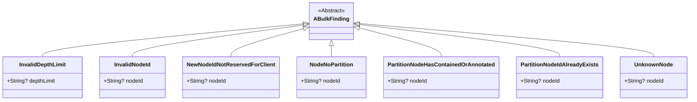

```mermaid
classDiagram

  class ABulkFinding
  <<Abstract>> ABulkFinding

  class InvalidDepthLimit {
    +String? depthLimit
  }
  ABulkFinding <|-- InvalidDepthLimit

  class InvalidNodeId {
    +String? nodeId
  }
  ABulkFinding <|-- InvalidNodeId

  class NewNodeIdNotReservedForClient {
    +String? nodeId
  }
  ABulkFinding <|-- NewNodeIdNotReservedForClient

  class NodeNoPartition {
    +String? nodeId
  }
  ABulkFinding <|-- NodeNoPartition

  class PartitionNodeHasContainedOrAnnotated {
    +String? nodeId
  }
  ABulkFinding <|-- PartitionNodeHasContainedOrAnnotated

  class PartitionNodeIdAlreadyExists {
    +String? nodeId
  }
  ABulkFinding <|-- PartitionNodeIdAlreadyExists

  class UnknownNode {
    +String? nodeId
  }
  ABulkFinding <|-- UnknownNode


```
