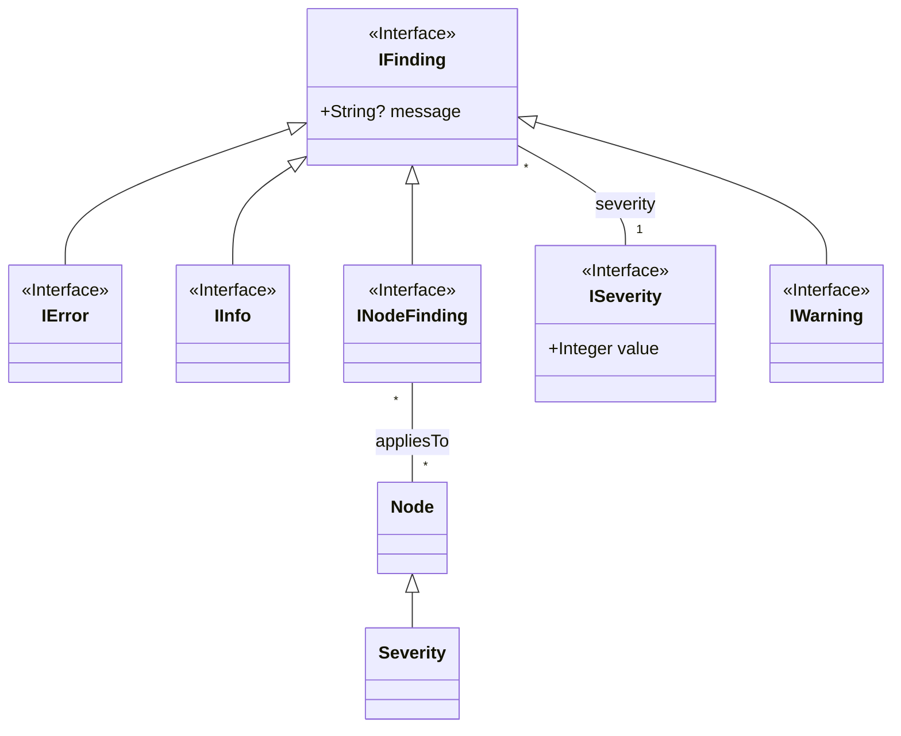

```mermaid
classDiagram

  class IError
  <<Interface>> IError
  IFinding <|-- IError

  class IFinding {
    +String? message
  }
  <<Interface>> IFinding

  class IInfo
  <<Interface>> IInfo
  IFinding <|-- IInfo

  class INodeFinding
  <<Interface>> INodeFinding
  IFinding <|-- INodeFinding

  class ISeverity {
    +Integer value
  }
  <<Interface>> ISeverity

  class IWarning
  <<Interface>> IWarning
  IFinding <|-- IWarning

  class Severity
  Node <|-- Severity


  IFinding "*" -- "1" ISeverity: severity

  INodeFinding "*" -- "*" Node: appliesTo


```
