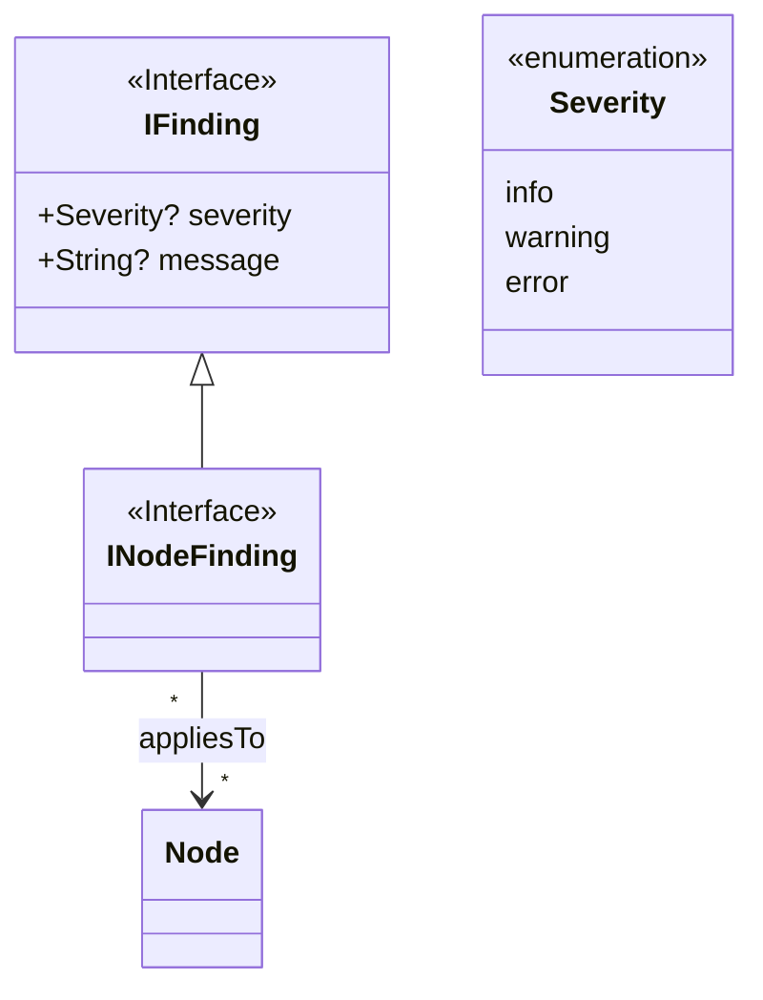

```mermaid
classDiagram

  class IFinding {
    +Severity? severity
    +String? message
  }
  <<Interface>> IFinding

  class INodeFinding
  <<Interface>> INodeFinding
  IFinding <|-- INodeFinding

  class Severity {
    <<enumeration>>
    info
    warning
    error
  }


  INodeFinding "*" --> "*" Node: appliesTo


```
