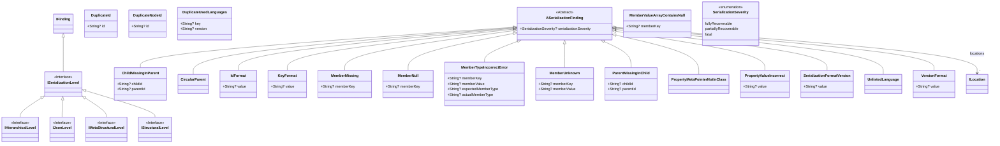

```mermaid
classDiagram

  class ASerializationFinding {
    +SerializationSeverity? serializationSeverity
  }
  <<Abstract>> ASerializationFinding

  class ChildMissingInParent {
    +String? childId
    +String? parentId
  }
  ASerializationFinding <|-- ChildMissingInParent

  class CircularParent
  ASerializationFinding <|-- CircularParent

  class DuplicateId {
    +String? id
  }

  class DuplicateNodeId {
    +String? id
  }

  class DuplicateUsedLanguages {
    +String? key
    +String? version
  }

  class IHierarchicalLevel
  <<Interface>> IHierarchicalLevel
  ISerializationLevel <|-- IHierarchicalLevel

  class IJsonLevel
  <<Interface>> IJsonLevel
  ISerializationLevel <|-- IJsonLevel

  class IMetaStructuralLevel
  <<Interface>> IMetaStructuralLevel
  ISerializationLevel <|-- IMetaStructuralLevel

  class ISerializationLevel
  <<Interface>> ISerializationLevel
  IFinding <|-- ISerializationLevel

  class IStructuralLevel
  <<Interface>> IStructuralLevel
  ISerializationLevel <|-- IStructuralLevel

  class IdFormat {
    +String? value
  }
  ASerializationFinding <|-- IdFormat

  class KeyFormat {
    +String? value
  }
  ASerializationFinding <|-- KeyFormat

  class MemberMissing {
    +String? memberKey
  }
  ASerializationFinding <|-- MemberMissing

  class MemberNull {
    +String? memberKey
  }
  ASerializationFinding <|-- MemberNull

  class MemberTypeIncorrectError {
    +String? memberKey
    +String? memberValue
    +String? expectedMemberType
    +String? actualMemberType
  }
  ASerializationFinding <|-- MemberTypeIncorrectError

  class MemberUnknown {
    +String? memberKey
    +String? memberValue
  }
  ASerializationFinding <|-- MemberUnknown

  class MemberValueArrayContainsNull {
    +String? memberKey
  }

  class ParentMissingInChild {
    +String? childId
    +String? parentId
  }
  ASerializationFinding <|-- ParentMissingInChild

  class PropertyMetaPointerNotInClass
  ASerializationFinding <|-- PropertyMetaPointerNotInClass

  class PropertyValueIncorrect {
    +String? value
  }
  ASerializationFinding <|-- PropertyValueIncorrect

  class SerializationFormatVersion {
    +String? value
  }
  ASerializationFinding <|-- SerializationFormatVersion

  class SerializationSeverity {
    <<enumeration>>
    fullyRecoverable
    partiallyRecoverable
    fatal
  }

  class UnlistedLanguage
  ASerializationFinding <|-- UnlistedLanguage

  class VersionFormat {
    +String? value
  }
  ASerializationFinding <|-- VersionFormat


  ASerializationFinding "1" o--> "*" ILocation: locations


```
