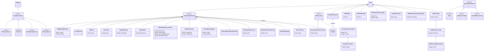

```mermaid
classDiagram

  class ASerializationFinding
  <<Abstract>> ASerializationFinding
  Node <|-- ASerializationFinding

  class ATextLocation
  <<Abstract>> ATextLocation
  Node <|-- ATextLocation

  class CharacterIndexTextLocation {
    +Integer? index
  }
  ATextLocation <|-- CharacterIndexTextLocation

  class ChildMissingInParent {
    +String? childId
    +String? parentId
  }
  ASerializationFinding <|-- ChildMissingInParent

  class CircularParent
  ASerializationFinding <|-- CircularParent

  class CompositeLocation
  Node <|-- CompositeLocation

  class DuplicateId {
    +String? id
  }
  Node <|-- DuplicateId

  class DuplicateNodeId {
    +String? id
  }
  Node <|-- DuplicateNodeId

  class DuplicateUsedLanguages {
    +String? key
    +String? version
  }
  Node <|-- DuplicateUsedLanguages

  class IFatal
  <<Interface>> IFatal
  ISerializationSeverity <|-- IFatal

  class IFullyRecoverable
  <<Interface>> IFullyRecoverable
  ISerializationSeverity <|-- IFullyRecoverable

  class IHierarchicalLevel
  <<Interface>> IHierarchicalLevel
  ISerializationLevel <|-- IHierarchicalLevel

  class IJsonLevel
  <<Interface>> IJsonLevel
  ISerializationLevel <|-- IJsonLevel

  class ILocation
  <<Interface>> ILocation

  class IMetaStructuralLevel
  <<Interface>> IMetaStructuralLevel
  ISerializationLevel <|-- IMetaStructuralLevel

  class IPartiallyRecoverable
  <<Interface>> IPartiallyRecoverable
  ISerializationSeverity <|-- IPartiallyRecoverable

  class ISerializationLevel
  <<Interface>> ISerializationLevel
  IFinding <|-- ISerializationLevel

  class ISerializationSeverity
  <<Interface>> ISerializationSeverity

  class IStructuralLevel
  <<Interface>> IStructuralLevel
  ISerializationLevel <|-- IStructuralLevel

  class IdFormat {
    +String? value
  }
  ASerializationFinding <|-- IdFormat

  class JsonPathLocation {
    +String? path
  }
  Node <|-- JsonPathLocation

  class KeyFormat {
    +String? value
  }
  ASerializationFinding <|-- KeyFormat

  class LineColumnTextLocation {
    +Integer? line
    +Integer? column
  }
  ATextLocation <|-- LineColumnTextLocation

  class MemberMissing {
    +String? memberKey
  }
  ASerializationFinding <|-- MemberMissing

  class MemberNull {
    +String? memberKey
  }
  ASerializationFinding <|-- MemberNull

  class MemberTypeIncorrectError {
    +String? memberKey
    +String? memberValue
    +String? expectedMemberType
    +String? actualMemberType
  }
  ASerializationFinding <|-- MemberTypeIncorrectError

  class MemberUnknown {
    +String? memberKey
    +String? memberValue
  }
  ASerializationFinding <|-- MemberUnknown

  class MemberValueArrayContainsNull {
    +String? memberKey
  }
  Node <|-- MemberValueArrayContainsNull

  class NodeFeatureIndexLocation {
    +Integer? index
  }
  NodeFeatureLocation <|-- NodeFeatureIndexLocation

  class NodeFeatureLocation {
    +String? featureKey
  }
  NodeLocation <|-- NodeFeatureLocation

  class NodeLocation {
    +String? nodeId
  }
  Node <|-- NodeLocation

  class ParentMissingInChild {
    +String? childId
    +String? parentId
  }
  ASerializationFinding <|-- ParentMissingInChild

  class PropertyMetaPointerNotInClass
  ASerializationFinding <|-- PropertyMetaPointerNotInClass

  class PropertyValueIncorrect {
    +String? value
  }
  ASerializationFinding <|-- PropertyValueIncorrect

  class RangeTextLocation {
    +Integer? length
  }
  LineColumnTextLocation <|-- RangeTextLocation

  class SerializationFormatVersion {
    +String? value
  }
  ASerializationFinding <|-- SerializationFormatVersion

  class UnlistedLanguage
  ASerializationFinding <|-- UnlistedLanguage

  class VersionFormat {
    +String? value
  }
  ASerializationFinding <|-- VersionFormat


  ASerializationFinding "1" o-- "*" ILocation: locations


  CompositeLocation "1" o-- "*" ILocation: locations


```
