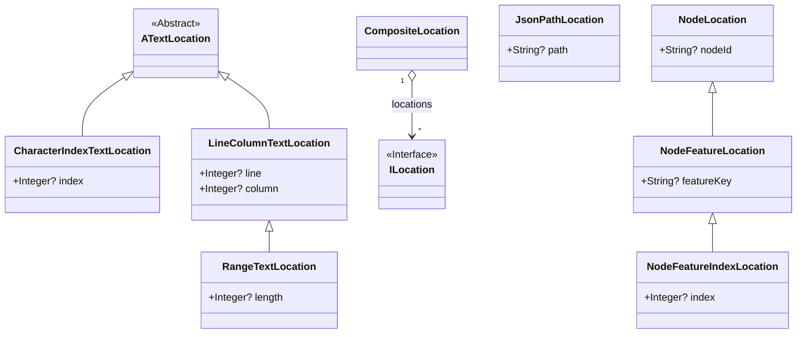

```mermaid
classDiagram

  class ATextLocation
  <<Abstract>> ATextLocation

  class CharacterIndexTextLocation {
    +Integer? index
  }
  ATextLocation <|-- CharacterIndexTextLocation

  class CompositeLocation

  class ILocation
  <<Interface>> ILocation

  class JsonPathLocation {
    +String? path
  }

  class LineColumnTextLocation {
    +Integer? line
    +Integer? column
  }
  ATextLocation <|-- LineColumnTextLocation

  class NodeFeatureIndexLocation {
    +Integer? index
  }
  NodeFeatureLocation <|-- NodeFeatureIndexLocation

  class NodeFeatureLocation {
    +String? featureKey
  }
  NodeLocation <|-- NodeFeatureLocation

  class NodeLocation {
    +String? nodeId
  }

  class RangeTextLocation {
    +Integer? length
  }
  LineColumnTextLocation <|-- RangeTextLocation


  CompositeLocation "1" o--> "*" ILocation: locations


```
